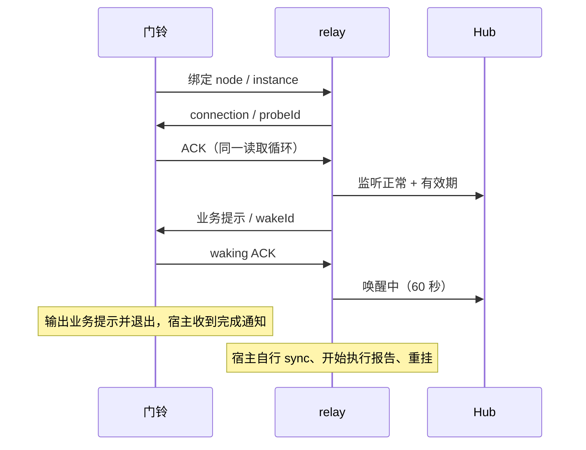

# 门铃链路探活 V1（2026-09-15）

## 0. 本质与现状

回答“此席位当前这次门铃实例是否在读取 SSE”；不能从 ACK 推出 Claude 宿主、登录、额度、执行能力健康。任务由 aster 授权：实现并替换 Air、Air2、Mini，再用 Computer Use 启动。

| 现有模块 | 能力与复用 | 风险 |
|---|---|---|
| relay/server.ts /api/events | SSE 与每 15 秒注释保活，复用端点及事件总线 | 无席位绑定、无客户端回执 |
| Registry /api/sync | 消息消费与真实取信时间，保持语义 | 心跳不得调用或刷新 |
| scripts/mesh-doorbell.sh | 历史长轮询与 drain | 新 SSE 默认入口；历史 drain 明确分开 |
| uplink/WebSocket + Hub devices | 已有认证、广播与断线恢复，增加监听快照消息 | 不用重复 register 报状态，避免污染上线账本 |

## 1. 约束与排除

| 约束 | 实际值 / 来源 | 影响 |
|---|---|---|
| 用户/部署 | aster 指定三台 Mac；实查 Hub 五台设备 | 单 relay 少量连接，既有服务内部实现 |
| 数据/流量 | 当前三台共 8 个注册节点，15 秒探针为用户建议参数 | 内存状态；无新数据库、队列或服务 |
| 团队/交付 | 本次交付并启动，用户原话 | 一版统一脚本与协议；2026-09-15T15:10Z /api/devices 采样五设备，三 Mac 共八节点 |
| 栈 | 实查 Node/TypeScript/Express/WebSocket + Bash | 无新依赖 |
| 预算/质量 | 用户明确“空闲不产生模型 turn” | 真 SSE 读取循环静默 ACK；零模型 API |
| 核心一致性 | 用户要求旧实例不能报新实例健康，心跳不动游标 | 席位、实例、连接和一次性挑战共同匹配 |
| 通信 | SSE 下行 + 本机 HTTP ACK + 既有 Hub WS | 只在真实读取回调 ACK |
| 峰值/读写比 | 不适用：少量内部席位，非用户业务数据流 | 不引入容量架构 |
| 不确定性 | Claude 后台任务生命周期需实测 | UI 启动与协议测试分开报告 |

排除独立定时无条件报活（用户明确禁止）、sync/消息 ack 探活（游标及取信污染）、周期叫模型（用户明确禁止）、新 daemon（用户明确禁止）。

## 2–4. 变化、流量与中间层

| 变化点 | 接缝 / 理由 |
|---|---|
| TTL 与宿主重挂耗时 | relay 15 秒 / 60 秒参数；唤醒宽限先用 60 秒，有限且不因重复回执延长 |
| SSE 客户端 | 独立 Node 脚本，Bash 入口 exec；不耦合模型工具实现 |
| Hub / UI | additive listener 状态 DTO；缺字段显示未核验 |

内部流量 10 倍仍为几十连接，首先增大的是全网快照广播和本地缓存写；V1 不增加层。候选新服务/队列：无所解决的当前问题、引入额外运维、没有触发证据，V1 不需要。进程内状态模块隔离实例竞态，不建立通用框架。

## 5–6. 边界与契约

| 模块 | 职责 | 契约 |
|---|---|---|
| DoorbellMonitor | 每席位当前实例、连接、挑战、唤醒期限 | 健康状态仅内存；实例世代/淘汰记录单独原子写入 db 旁 0600 文件并 fsync，跨重启保留 fencing；relay 重启健康全部未核验；新实例 fence 旧实例和旧连接 |
| SSE /api/events?nodeId=&instanceId= | 绑定注册 pull 席位；下发私有 probe / message / replaced | 参数不全 400，未注册 404，非 pull / 已淘汰实例 409；无参仍兼容 dashboard |
| POST /api/doorbell/ack | 校验实例+连接+probeId 或 wakeId | 一次性随机挑战，错误/过期/重放 409；不调用 sync、Store.ack 或 heartbeat；waking 回执同一 wakeId 重试返回成功，绝不延长期限 |
| POST /api/doorbell/execution | 宿主拿到门铃输出并真正开始处理后报告 | 绑定本次 wakeId；记录“宿主报告开始执行”，不能由探针推导 |
| SSE 客户端 | 同一读取循环处理探针回 ACK；业务提示回 waking ACK 后输出一次并退出 | 断线静默退避；无空闲退出；已淘汰实例静默停驻，不能抢回席位 |
| Hub listener_status | 已认证的当前 relay WS 上报其注册节点监听快照 | 不改注册/消息账本；每 15 秒及变化时上报；Hub 按接收时刻限定有效期 |
| status/devices/dashboard | listening/waking/lost/unknown 四态及独立时间 | 未接入 unknown；连接断/ACK 过期 lost；唤醒宽限有限；缓存过期不能假绿 |

探针每 15 秒下发，首次立即下发。只允许当前 SSE 连接的未过期、未使用 challenge 更新 lastAckAt；有连接无 ACK 先未核验，60 秒后失联。显式 waking ACK 先于进程退出，宽限 60 秒；再次绑定新门铃，收到新 ACK 才监听正常。旧实例已被替换后不得重连反抢。断开期间积压通过连接建立后的只读 backlog 检查补铃，不消费游标。广播不唤醒。

### 快照与兼容细则

ListenerStatus 字段：nodeId、state、instanceId、connected、lastAckAt、lastSyncAt、lastExecutionStartedAt、observedAt、expiresAt、validForMs。relay 计算剩余有效毫秒数；Hub 对当前已认证 WS 与注册节点验归属，按接收时刻加剩余时间（至多 60 秒）建立独立 expiresAt。其他 relay 广播保留原截止时间，同时重新计算当时剩余 validForMs，不能续期。消费 relay 收到时将剩余 TTL 映射为本机截止时间，以免机器时差延长绿色；每次读缓存/磁盘恢复后都按本机 expiresAt 降级；不看 DeviceInventory.updatedAt。Hub 断开不续期，最迟原证据到期转失联。

探针 ACK 具有 5 秒总截止时间，HTTP 响应截断、aborted、error 都使请求失败，不得只等 end；失败断开后静默重连（1 秒至 15 秒退避）。waking ACK 最多重试三次；响应丢失时相同 wakeId 幂等成功，失败则重连并由只读积压再提示。waking TTL 从第一次成功 ACK 起算。

新脚本 stdout = 一行 `{event:"doorbell:message",data:{nodeId,instanceId,connectionId,wakeId,msgId}}`；它不是消息正文。原长轮询消费者若确实需要旧 `PARKED_SECONDS + JSON`，显式设置 `MESH_DOORBELL_LEGACY_SYNC=1`；`--drain` 保留。三机 Claude 按新提示取信并报告 execution 后重新挂起。

V1 部署明确保持 `MESH_WAKE` 关闭（不配置 hook），三机从进程环境/启动日志读回验证；新门铃直接处理 msg:send 与积压提示。旧 fallback wake/sweeper/hook 属于被关闭的另一条路径，不能与这版并用来重复叫醒。以后确需启用，先完成独立监听状态抑制与跨路径测试再开。现有 watchdog 若只认 ps，应读新 listener 字段；不新增服务。

## 7. 成本决策

递增：绑定、挑战、状态 DTO 和 Hub 消息形状；当前做准。恒定：TTL、重试间隔、显示样式，留参数。执行开始独立记录，不能把 sync 当成执行。兼容升级先 Hub，再三台 relay 与脚本。

## 8. 图

## 9. 演进

| 阶段 | 做 / 不做 | 完成标志 / 下一阶段触发 |
|---|---|---|
| V1 | 三台统一代码、实例 fencing、ACK 与状态、故障测试、CU 启动；无新服务、无周期模型 | kill 失联、旧实例拒绝、游标不动、空闲零输出/零 turn；三台真实运行证据 |
| V1.5 | 根据实际误报调整宽限；补充宿主执行证明 | 实测存在正常重挂超过 60 秒，或有 ACK 但业务不执行的事故 |
| V2 | 需要时设计宿主健康独立维度 | 积累宿主登录/额度失效证据；不得把监听 ACK 升格为宿主健康 |

## 10. 后续修改指南

协议改前看本文件、protocol/types.ts 与 HTTP/Hub 契约测试；时限调整改 monitor 参数并验证断线、重放、重挂；客户端修改跑真实子进程测试；Hub 改动验证跨 relay 身份隔离与缓存过期。不要让探针接触消息确认游标，不要恢复旧的进程存在即健康判法。部署前保护三机工作树并记录实际运行文件哈希。

## 11. 独立架构审查

由未带对话历史的 fresh agent 按 arch-design 清单只读审查，结果在交付证据记录。
